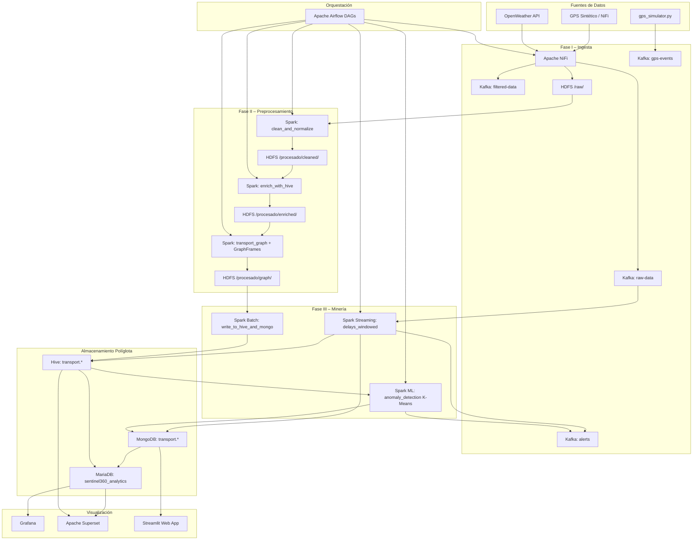
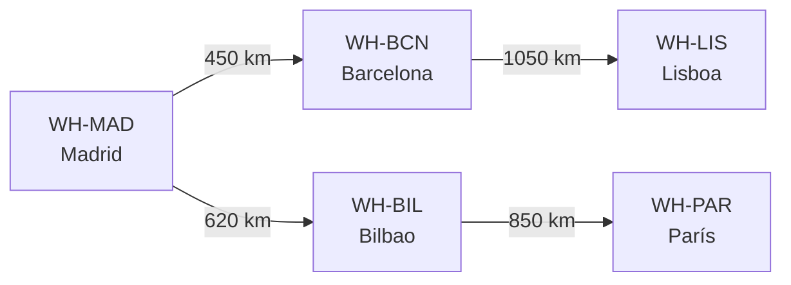
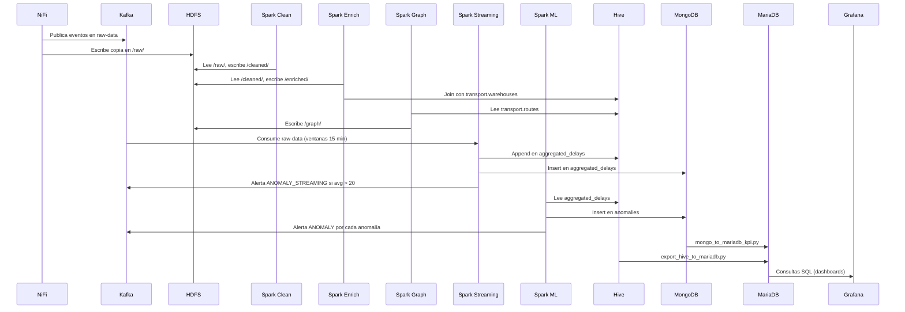
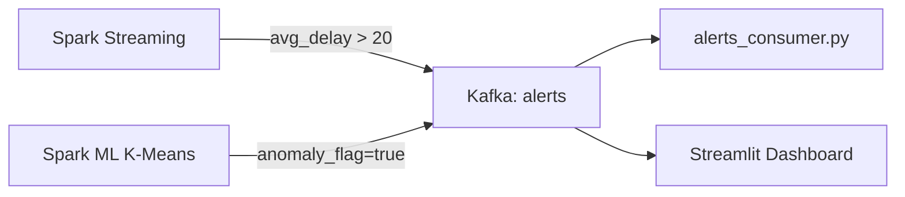

# Documento de Diseño Técnico – Sentinel360

## Visión General

Sentinel360 es un sistema de inteligencia logística proactiva que implementa el ciclo KDD (Knowledge Discovery in Databases) sobre un stack Apache distribuido. Transforma telemetría GPS masiva y datos meteorológicos en KPIs operativos, detección de anomalías y análisis de grafos de rutas, accesibles desde dashboards en tiempo casi real.

El sistema opera sobre un clúster multi-nodo Hadoop/YARN e integra: NiFi (ingesta), Kafka (bus de eventos), Spark (procesamiento batch y streaming), Hive (data warehouse), MongoDB (estado operativo), MariaDB (capa analítica), Airflow (orquestación), Grafana, Superset y una interfaz web Streamlit.


---

## Arquitectura

### Topología del Clúster

El sistema se despliega sobre tres nodos físicos/VMs con roles diferenciados:

| Nodo   | IP             | Servicios                                                        |
|--------|----------------|------------------------------------------------------------------|
| hadoop | 192.168.99.10  | NameNode, ResourceManager, Kafka (KRaft), NiFi, HiveServer2     |
| nodo1  | 192.168.99.12  | DataNode, NodeManager                                            |
| nodo2  | 192.168.99.14  | DataNode, NodeManager                                            |

El nodo master concentra todos los servicios de coordinación. Los nodos de trabajo aportan capacidad de almacenamiento HDFS y cómputo YARN. La configuración centralizada en `config.py` actúa como SSOT (Single Source of Truth): IPs, rutas HDFS, topics Kafka, tablas Hive y URIs de bases de datos se definen una sola vez y se importan en todos los scripts y DAGs.

### Diagrama de Arquitectura General



### Capa de Demo Docker

Para entornos de demostración, `docker/docker-compose.yml` levanta MariaDB, Superset, Grafana y un contenedor `tools` (Python) que puede ejecutar scripts del repositorio. El clúster Big Data (Hadoop, Kafka, Spark, Hive, NiFi) permanece en los nodos on-premise.


---

## Componentes e Interfaces

### Fase I – Ingesta (`ingest/`, `scripts/`)

**Apache NiFi** orquesta dos flujos de ingesta independientes:

- **Flujo GPS** (`gps_transport_flow_importable.json`): lee ficheros GPS (JSON Lines o CSV) desde un directorio de entrada, aplica un filtro de velocidad (`speed < 120 km/h`) para publicar en `filtered-data`, y publica todos los eventos en `raw-data`. Escribe una copia inmutable en HDFS `/user/hadoop/proyecto/raw/`.
- **Flujo OpenWeather** (`http_weather_flow_importable.json`): invoca la API OpenWeather mediante `InvokeHTTP` y publica la respuesta en `raw-data`.

**Script alternativo** `scripts/ingest_openweather.py`: permite la ingesta meteorológica sin depender del flujo NiFi, útil en entornos donde NiFi no está disponible.

**Simulador GPS** `scripts/gps_simulator.py`: genera eventos GPS sintéticos con campos `vehicle_id`, `route_id`, `lat`, `lon`, `speed`, `delay_minutes`, `timestamp` y los publica en el topic Kafka `gps-events` a razón de un evento por segundo.

**Generador sintético** `data/sample/generate_synthetic_gps.py`: genera ficheros CSV y JSON Lines a partir de los maestros `warehouses.csv` y `routes.csv`.

**Interfaces Kafka**:
- `raw-data`: todos los eventos GPS y meteorológicos sin filtrar.
- `filtered-data`: eventos GPS con `speed < 120 km/h`.
- `gps-events`: eventos del simulador GPS.
- `alerts`: alertas de anomalías (batch y streaming).

### Fase II – Preprocesamiento (`spark/cleaning/`, `spark/graph/`)

**`clean_and_normalize.py`**: job Spark sobre YARN que lee desde HDFS raw, normaliza nombres de columnas a minúsculas, rellena nulos (`speed → 0.0`, `warehouse_id → "UNKNOWN"`), elimina duplicados por `event_id` (o por `vehicle_id + ts`), convierte `ts` a timestamp y escribe en Parquet en `/procesado/cleaned/`.

**`enrich_with_hive.py`**: job Spark que realiza un left join entre los eventos limpios y la tabla Hive `transport.warehouses` por `warehouse_id`, añadiendo `warehouse_name` y `warehouse_city`. Escribe en Parquet en `/procesado/enriched/`.

**`transport_graph.py`**: job Spark con GraphFrames que construye un grafo dirigido (vértices: almacenes, aristas: rutas ponderadas por `distance_km`), calcula caminos más cortos (`shortestPaths`) hacia los almacenes de referencia y componentes conectados (`connectedComponents`). Escribe en Parquet en `/procesado/graph/`.

### Fase III – Minería (`spark/streaming/`, `spark/ml/`)

**`delays_windowed.py`**: job Spark Structured Streaming que consume desde Kafka `raw-data` o desde ficheros CSV en HDFS raw. Aplica watermark de 10 minutos sobre `ts`, agrupa por ventanas de 15 minutos y `warehouse_id`, calcula `avg_delay_min` y `vehicle_count`. Por cada micro-batch escribe en Hive `transport.aggregated_delays` (append) y en MongoDB `transport.aggregated_delays`. Si `avg_delay_min > 20`, publica una alerta `ANOMALY_STREAMING` en Kafka `alerts`. El checkpoint se persiste en HDFS.

**`write_to_hive_and_mongo.py`**: job Spark batch que lee Parquet de `/procesado/aggregated_delays/` y lo vuelca en Hive `transport.aggregated_delays` en modo append. Usado en el DAG de Fase III batch.

**`anomaly_detection.py`**: job Spark ML que carga `transport.aggregated_delays` desde Hive, entrena K-Means con k=3 sobre `(avg_delay_min, vehicle_count)`, identifica el cluster con mayor centroide de `avg_delay_min` como cluster anómalo, escribe los registros anómalos en MongoDB `transport.anomalies` y publica una alerta `ANOMALY` en Kafka `alerts` por cada anomalía.

### Capa de Exportación y Visualización

**`scripts/mongo_to_mariadb_kpi.py`**: lee agregados desde MongoDB (o Parquet como fallback) y calcula KPIs por vehículo y por almacén. Inserta en las tablas `kpi_delays_by_vehicle`, `kpi_delays_by_warehouse` y `kpi_anomalies` de MariaDB `sentinel360_analytics`.

**`scripts/export_hive_to_mariadb.py`**: exporta directamente desde Hive a las tablas `kpi_hive_aggregated_delays` y `kpi_hive_reporte_diario` de MariaDB.

**Grafana**: conectado a MariaDB `sentinel360_analytics`. Dashboard `sentinel360-kpis.json` con paneles de retraso medio por almacén (serie temporal), top almacenes y vehículos activos. Provisionado automáticamente desde `grafana/provisioning/`.

**Apache Superset**: conectado a MariaDB `sentinel360_analytics`. Permite filtrar por almacén, rango de fechas y franja horaria. Accesible en `http://localhost:8089`.

**Streamlit** (`web/presentacion_sentinel360_app.py`): interfaz web con 7+ secciones navegables que recorre el ciclo KDD, permite cargar ficheros, muestra un mapa interactivo de almacenes y visualiza agregados y anomalías desde MongoDB.

**`scripts/alerts_consumer.py`**: consumer Kafka del topic `alerts` que muestra cada alerta por consola con tipo, almacén, ventana temporal y retraso medio.

### Orquestación (`airflow/`)

Ocho DAGs de Airflow gestionan el ciclo de vida completo:

| DAG | Descripción |
|-----|-------------|
| `sentinel360_infra_start` | Arranque de servicios del clúster |
| `sentinel360_infra_stop` | Parada ordenada de servicios |
| `sentinel360_fase_I_ingesta` | Kafka topics → GPS sintético → OpenWeather |
| `sentinel360_fase_II_preprocesamiento` | Hive setup → limpieza → enriquecimiento → grafo |
| `sentinel360_fase_III_batch` | Agregados → anomalías → KPIs a MariaDB |
| `sentinel360_fase_III_streaming` | Inicio controlado del job de streaming |
| `sentinel360_dashboards_levantar` | Levanta Grafana y Superset |
| `sentinel360_dashboards_exportar` | Exporta datos a MariaDB para dashboards |

Todos los DAGs incluyen política de reintentos (`retries=1`, `retry_delay=2-5 min`) y una tarea final `reporte_ejecucion` que registra el estado de cada tarea.


---

## Modelos de Datos

### HDFS – Jerarquía de Rutas

```
/user/hadoop/proyecto/
├── raw/                          # Datos crudos inmutables (NiFi → HDFS)
│   ├── gps_events*.csv
│   └── gps_events*.json
├── warehouses/                   # Datos maestros: almacenes (CSV)
├── routes/                       # Datos maestros: rutas (CSV)
├── procesado/
│   ├── cleaned/                  # Parquet: eventos GPS limpios
│   ├── enriched/                 # Parquet: eventos enriquecidos con datos de almacén
│   ├── graph/
│   │   ├── shortest_paths/       # Parquet: caminos más cortos (GraphFrames)
│   │   └── connected_components/ # Parquet: componentes conectados
│   ├── aggregated_delays/        # Parquet: ventanas de retrasos (batch)
│   ├── models/                   # Modelos ML serializados (K-Means)
│   └── temp/                     # Staging intermedio
└── checkpoints/
    ├── delays/                   # Checkpoint del streaming de retrasos
    └── graph/                    # Checkpoint para connectedComponents
```

### Apache Hive – Base de Datos `transport`

**`transport.warehouses`** (tabla externa, TEXTFILE, CSV):
```sql
warehouse_id  STRING   -- Identificador único (ej: WH-MAD)
name          STRING   -- Nombre del almacén
city          STRING   -- Ciudad
country       STRING   -- País
lat           DOUBLE   -- Latitud
lon           DOUBLE   -- Longitud
capacity      INT      -- Capacidad operativa
```
LOCATION: `/user/hadoop/proyecto/warehouses`

**`transport.routes`** (tabla externa, TEXTFILE, CSV):
```sql
route_id          STRING   -- Identificador de ruta
from_warehouse_id STRING   -- Almacén origen (FK → warehouses.warehouse_id)
to_warehouse_id   STRING   -- Almacén destino (FK → warehouses.warehouse_id)
distance_km       DOUBLE   -- Distancia en kilómetros
avg_duration_min  INT      -- Duración media en minutos
```
LOCATION: `/user/hadoop/proyecto/routes`

**`transport.events_raw`** (tabla externa, TEXTFILE, CSV):
```sql
event_id     STRING
vehicle_id   STRING
ts           TIMESTAMP
lat          DOUBLE
lon          DOUBLE
speed        DOUBLE
warehouse_id STRING
```
LOCATION: `/user/hadoop/proyecto/raw`

**`transport.aggregated_delays`** (tabla gestionada, PARQUET):
```sql
window_start   TIMESTAMP   -- Inicio de la ventana de 15 min
window_end     TIMESTAMP   -- Fin de la ventana de 15 min
warehouse_id   STRING      -- Almacén asociado
avg_delay_min  DOUBLE      -- Retraso medio en minutos
vehicle_count  BIGINT      -- Número de vehículos en la ventana
```
LOCATION: `/user/hadoop/proyecto/procesado/aggregated_delays`

**`transport.reporte_diario_retrasos`** (tabla gestionada, PARQUET):
```sql
fecha_reportado  DATE
warehouse_id     STRING
total_vehiculos  BIGINT
avg_retraso_min  DOUBLE
ventanas_15min   INT
```

### MongoDB – Base de Datos `transport`

**`vehicle_state`**: estado actual por vehículo (actualización continua desde streaming).
```json
{
  "vehicle_id": "V-001",
  "updated_at": "2026-03-01T10:15:00Z",
  "lat": 40.4168,
  "lon": -3.7038,
  "speed": 85.3,
  "warehouse_id": "WH-MAD"
}
```
Índices: `{ vehicle_id: 1 }` (único), `{ updated_at: -1 }`.

**`aggregated_delays`**: ventanas de retrasos insertadas por el streaming.
```json
{
  "window_start": "2026-03-01T10:00:00",
  "window_end": "2026-03-01T10:15:00",
  "warehouse_id": "WH-MAD",
  "avg_delay_min": 12.5,
  "vehicle_count": 8
}
```
Índices: `{ window_start: -1 }`, `{ warehouse_id: 1, window_start: -1 }`.

**`anomalies`**: anomalías detectadas por K-Means batch.
```json
{
  "window_start": "2026-03-01T10:00:00",
  "window_end": "2026-03-01T10:15:00",
  "warehouse_id": "WH-BCN",
  "avg_delay_min": 35.2,
  "vehicle_count": 12,
  "cluster": 2,
  "anomaly_flag": true
}
```
Índices: `{ warehouse_id: 1, window_start: -1 }`.

### MariaDB – Base de Datos `sentinel360_analytics`

**`kpi_delays_by_vehicle`**: KPIs de retrasos agregados por vehículo y ventana temporal.
```sql
id                BIGINT UNSIGNED AUTO_INCREMENT PK
vehicle_id        VARCHAR(64)
window_start      DATETIME
window_end        DATETIME
trips_count       INT UNSIGNED
delayed_trips     INT UNSIGNED
avg_delay_minutes DECIMAL(10,2)
max_delay_minutes DECIMAL(10,2)
created_at        TIMESTAMP
updated_at        TIMESTAMP
```

**`kpi_delays_by_warehouse`**: KPIs de retrasos agregados por almacén y ventana temporal. Mismo esquema que `kpi_delays_by_vehicle` con `warehouse_id` en lugar de `vehicle_id`.

**`kpi_hive_aggregated_delays`**: exportación directa desde Hive `transport.aggregated_delays`.
```sql
id            BIGINT UNSIGNED AUTO_INCREMENT PK
window_start  DATETIME
window_end    DATETIME
warehouse_id  VARCHAR(64)
avg_delay_min DECIMAL(10,2)
vehicle_count BIGINT UNSIGNED
created_at    TIMESTAMP
```

**`kpi_anomalies`**: anomalías exportadas desde MongoDB `transport.anomalies`.
```sql
id            BIGINT UNSIGNED AUTO_INCREMENT PK
warehouse_id  VARCHAR(64)
window_start  DATETIME
window_end    DATETIME
avg_delay_min DECIMAL(10,2)
vehicle_count INT UNSIGNED
anomaly_flag  TINYINT(1)
created_at    TIMESTAMP
```


---

## Diseño del Grafo Logístico

### Modelo de Grafo

La red logística se modela como un **grafo dirigido ponderado** usando GraphFrames sobre Spark:

- **Vértices**: almacenes (`transport.warehouses`). Cada vértice tiene `id = warehouse_id` y `type = "warehouse"`.
- **Aristas**: rutas (`transport.routes`). Cada arista tiene `src = from_warehouse_id`, `dst = to_warehouse_id` y `weight = distance_km`.



### Algoritmos Aplicados

**Caminos más cortos** (`shortestPaths`): calcula la distancia mínima desde cada vértice hasta los almacenes de referencia configurados (por defecto `WH-MAD` y `WH-BCN`). Resultado: DataFrame con columna `distances` (mapa `landmark → distancia`). Escrito en `/procesado/graph/shortest_paths/`.

**Componentes conectados** (`connectedComponents`): identifica subgrafos desconectados de la red. Requiere checkpoint en HDFS para grafos con ciclos. Resultado: DataFrame con columna `component` (identificador del componente). Escrito en `/procesado/graph/connected_components/`.

### Decisión de Diseño: GraphFrames vs NetworkX

Se eligió **GraphFrames** (distribuido sobre Spark/YARN) frente a NetworkX (local) porque:
1. Los datos de vértices y aristas ya residen en HDFS/Hive, evitando transferencias.
2. El grafo puede crecer con la red logística sin cambiar el código.
3. Los resultados se escriben directamente en HDFS en formato Parquet, integrándose con el resto del pipeline.

La contrapartida es la necesidad de incluir el paquete `graphframes:graphframes:0.8.3-spark3.5-s_2.12` en el `spark-submit`, gestionado por `scripts/run_spark_submit.sh`.

---

## Flujos de Datos entre Componentes

### Flujo Principal (Pipeline KDD Completo)



### Flujo de Alertas



### Flujo de Fallback

Si MongoDB no está disponible durante el streaming, `delays_windowed.py` captura la excepción de pymongo y continúa escribiendo únicamente en Hive. Si MongoDB falla durante la exportación de KPIs, `mongo_to_mariadb_kpi.py` intenta leer desde ficheros Parquet en HDFS como fuente alternativa.


---

## Decisiones de Diseño Relevantes

### 1. Almacenamiento Políglota (Hive + MongoDB + MariaDB)

Cada capa de almacenamiento está optimizada para su caso de uso:
- **Hive**: agregaciones analíticas históricas y auditoría. Consultas SQL sobre grandes volúmenes.
- **MongoDB**: baja latencia para estado operativo de vehículos y anomalías recientes. Esquema flexible para documentos de alerta.
- **MariaDB**: capa de servicio para Grafana y Superset. Consultas rápidas sobre KPIs precalculados.

### 2. Inmutabilidad de Datos Crudos

Los datos en HDFS `/raw/` nunca se modifican ni eliminan automáticamente. Esta decisión permite reprocesar el pipeline completo ante cambios en reglas de negocio sin pérdida de información. Los jobs de limpieza siempre leen de `/raw/` y escriben en `/procesado/`.

### 3. Modo Dual de Entrada para Streaming

`delays_windowed.py` soporta dos modos: `kafka` (producción) y `file` (desarrollo/pruebas). Esto permite probar el pipeline completo sin necesidad de un broker Kafka activo, usando ficheros CSV en HDFS raw.

### 4. Detección de Anomalías en Dos Capas

- **Streaming** (`delays_windowed.py`): umbral fijo de 20 minutos. Latencia baja, sin entrenamiento.
- **Batch** (`anomaly_detection.py`): K-Means con k=3. Umbral adaptativo basado en los datos históricos. Mayor precisión, mayor latencia.

Ambas capas publican en el mismo topic Kafka `alerts` con tipos distintos (`ANOMALY_STREAMING` vs `ANOMALY`), permitiendo que los consumidores diferencien el origen.

### 5. Configuración Centralizada como SSOT

`config.py` centraliza todas las IPs, rutas y nombres de servicios. Los parámetros de conexión a MongoDB y MariaDB pueden sobrescribirse mediante variables de entorno, lo que facilita el despliegue en diferentes entornos (desarrollo, demo Docker, producción) sin modificar código.

### 6. Orquestación con DAGs Independientes por Fase

Cada fase KDD tiene su propio DAG en Airflow, lo que permite ejecutarlas de forma independiente o encadenada. Esta separación facilita el reintento parcial del pipeline ante fallos y la ejecución programada de fases específicas (ej: batch nocturno de Fase III sin re-ejecutar la ingesta).

### 7. Checkpoint de Streaming en HDFS

El checkpoint del Structured Streaming se persiste en HDFS (no en disco local) para garantizar la recuperación ante reinicios del job en cualquier nodo del clúster YARN, sin pérdida ni duplicación de datos.


---

## Propiedades de Corrección

*Una propiedad es una característica o comportamiento que debe mantenerse verdadero en todas las ejecuciones válidas del sistema; esencialmente, una afirmación formal sobre lo que el sistema debe hacer. Las propiedades sirven como puente entre las especificaciones legibles por humanos y las garantías de corrección verificables por máquinas.*

### Propiedad 1: Filtrado de velocidad en ingesta

*Para cualquier* evento GPS con campo `speed >= 120 km/h`, el evento NO debe aparecer en el topic Kafka `filtered-data`. Para cualquier evento con `speed < 120 km/h`, el evento SÍ debe aparecer en `filtered-data`.

**Valida: Requisito 1.2**

### Propiedad 2: Inmutabilidad de datos crudos en HDFS

*Para cualquier* fichero GPS procesado por NiFi y cualquier job Spark de limpieza ejecutado posteriormente, el contenido del fichero en HDFS `/raw/` debe ser idéntico antes y después de la ejecución del job.

**Valida: Requisitos 1.3, 3.1, 3.2**

### Propiedad 3: Compatibilidad de formatos de entrada

*Para cualquier* fichero GPS válido en formato JSON Lines o CSV con los campos requeridos (`event_id`, `vehicle_id`, `ts`, `lat`, `lon`, `speed`, `warehouse_id`), el job `clean_and_normalize.py` debe procesarlo sin error y producir un Parquet con el mismo número de registros válidos.

**Valida: Requisitos 1.5, 4.1**

### Propiedad 4: Eliminación de registros con campos nulos obligatorios

*Para cualquier* dataset de eventos GPS con registros que tengan `vehicle_id`, `ts`, `lat` o `lon` nulos, el dataset limpio resultante no debe contener ningún registro con esos campos nulos.

**Valida: Requisito 4.1**

### Propiedad 5: Normalización del campo timestamp

*Para cualquier* evento GPS con campo `ts` en formato de cadena de texto, tras ejecutar `clean_and_normalize.py` el campo `ts` en el Parquet resultante debe ser de tipo timestamp válido (no nulo, parseable como ISO 8601).

**Valida: Requisito 4.2**

### Propiedad 6: Descarte de velocidades inválidas

*Para cualquier* evento GPS con `speed < 0` o `speed > 300`, el evento no debe aparecer en el dataset limpio resultante de `clean_and_normalize.py`.

**Valida: Requisito 4.3**

### Propiedad 7: Completitud del enriquecimiento (left join)

*Para cualquier* evento limpio con `warehouse_id` presente en `transport.warehouses`, el evento enriquecido debe contener `warehouse_name` y `warehouse_city` no nulos. Para cualquier evento con `warehouse_id` ausente en `transport.warehouses`, el evento debe conservarse con `warehouse_name` y `warehouse_city` nulos.

**Valida: Requisitos 5.1, 5.3**

### Propiedad 8: Integridad estructural del grafo

*Para cualquier* conjunto de almacenes y rutas cargados desde Hive, el grafo construido por `transport_graph.py` debe tener exactamente tantos vértices como almacenes distintos y todos los vértices deben tener asignado un componente conectado.

**Valida: Requisitos 6.1, 6.3**

### Propiedad 9: Corrección de los agregados de streaming

*Para cualquier* conjunto de eventos GPS en una ventana de 15 minutos agrupados por `warehouse_id`, el `avg_delay_min` calculado por `delays_windowed.py` debe ser igual a la media aritmética de los valores `delay_min` de esos eventos, y `vehicle_count` debe ser igual al número de eventos en la ventana.

**Valida: Requisito 7.1**

### Propiedad 10: Persistencia multicapa de agregados

*Para cualquier* ventana temporal completada por el streaming, los agregados deben aparecer tanto en la tabla Hive `transport.aggregated_delays` como en la colección MongoDB `transport.aggregated_delays` (cuando MongoDB está disponible).

**Valida: Requisitos 7.2, 7.3**

### Propiedad 11: Generación de alertas por umbral de retraso

*Para cualquier* ventana temporal con `avg_delay_min > 20`, debe existir exactamente un mensaje en el topic Kafka `alerts` con los campos `type`, `warehouse_id`, `window_start`, `window_end`, `avg_delay_min`, `vehicle_count` y `threshold`.

**Valida: Requisito 7.4**

### Propiedad 12: Cobertura total de clustering K-Means

*Para cualquier* dataset de agregados de retrasos con al menos 3 registros distintos, el modelo K-Means entrenado por `anomaly_detection.py` debe asignar exactamente uno de los 3 clusters como anómalo (el de mayor `avg_delay_min` en el centroide) y todos los registros deben tener `anomaly_flag` asignado.

**Valida: Requisito 8.1**

### Propiedad 13: Correspondencia 1:1 entre anomalías y alertas

*Para cualquier* conjunto de registros marcados como anómalos por K-Means, debe existir exactamente una alerta en Kafka `alerts` con `type: "ANOMALY"` por cada registro anómalo, y cada anomalía debe aparecer en MongoDB `transport.anomalies` con todos los campos requeridos.

**Valida: Requisitos 8.2, 8.3**

### Propiedad 14: Round-trip de KPIs MongoDB → MariaDB

*Para cualquier* conjunto de agregados en MongoDB `transport.aggregated_delays`, tras ejecutar `mongo_to_mariadb_kpi.py` los KPIs calculados (retraso medio por almacén, por vehículo) deben aparecer en las tablas correspondientes de MariaDB con valores matemáticamente correctos.

**Valida: Requisitos 9.1, 9.2**

### Propiedad 15: Política de reintentos en todos los DAGs

*Para cualquier* DAG de Airflow del sistema Sentinel360, la configuración `default_args` debe incluir `retries >= 1` y `retry_delay` entre 2 y 5 minutos.

**Valida: Requisito 12.5**

### Propiedad 16: Tarea de reporte en todos los DAGs

*Para cualquier* DAG de Airflow del sistema Sentinel360, debe existir una tarea `reporte_ejecucion` con `trigger_rule="all_done"` que se ejecute al finalizar el DAG independientemente del resultado de las tareas anteriores.

**Valida: Requisito 12.6**

### Propiedad 17: Completitud de campos en eventos del simulador

*Para cualquier* evento GPS generado por `gps_simulator.py`, el evento debe contener todos los campos requeridos: `vehicle_id`, `route_id`, `lat`, `lon`, `speed`, `delay_minutes`, `timestamp`, con valores no nulos.

**Valida: Requisito 14.1**

### Propiedad 18: Coordenadas geográficas dentro del área configurada

*Para cualquier* evento GPS generado por `gps_simulator.py` o `generate_synthetic_gps.py`, las coordenadas `lat` y `lon` deben estar dentro de los límites geográficos de la red logística configurada (derivados de las coordenadas de los almacenes en `warehouses.csv`).

**Valida: Requisito 14.3**

### Propiedad 19: Tipos de alerta válidos

*Para cualquier* mensaje publicado en el topic Kafka `alerts`, el campo `type` debe ser exactamente `"ANOMALY"` (batch K-Means) o `"ANOMALY_STREAMING"` (streaming umbral fijo).

**Valida: Requisito 15.3**

### Propiedad 20: Sobrescritura de configuración por variables de entorno

*Para cualquier* variable de entorno definida entre `MONGO_URI`, `MARIA_DB_URI`, `MARIA_DB_HOST`, `MARIA_DB_PORT`, `MARIA_DB_USER`, `MARIA_DB_PASSWORD`, `MARIA_DB_NAME`, el valor leído por `config.py` debe ser el de la variable de entorno, no el valor por defecto hardcodeado.

**Valida: Requisito 16.2**


---

## Manejo de Errores

### Ingesta (Fase I)

- **API OpenWeather no disponible**: NiFi registra el error en el log del procesador y continúa el flujo GPS sin interrupciones. El script alternativo `ingest_openweather.py` puede ejecutarse de forma independiente.
- **Directorio de entrada vacío**: NiFi permanece en espera activa con polling cada 5 segundos. No genera errores.
- **Formato de fichero inválido**: NiFi enruta el fichero al procesador de error y lo registra. El pipeline continúa con los ficheros válidos.

### Preprocesamiento (Fase II)

- **Datos crudos vacíos**: `clean_and_normalize.py` lanza `ValueError` con mensaje descriptivo si no encuentra ficheros GPS en `/raw/`. El DAG de Airflow captura el fallo y reintenta.
- **Columnas esperadas ausentes**: `clean_and_normalize.py` lanza `ValueError` listando las columnas encontradas vs. esperadas.
- **Tabla `transport.routes` vacía**: `transport_graph.py` registra un error descriptivo y finaliza sin escritura parcial en HDFS.
- **GraphFrames no disponible**: `transport_graph.py` detecta el `ImportError` y termina con código de salida 1, indicando el comando `spark-submit` correcto.

### Streaming (Fase III)

- **MongoDB no disponible**: `delays_windowed.py` captura la excepción de pymongo en `write_batch_to_hive_and_mongo` y continúa escribiendo únicamente en Hive. El streaming no se interrumpe.
- **Kafka no disponible para alertas**: la excepción del `KafkaProducer` se captura y se registra, sin interrumpir el procesamiento del micro-batch.
- **SparkContext detenido durante micro-batch**: se captura la excepción y se registra el batch_id afectado sin propagar el error.
- **Tabla `transport.aggregated_delays` vacía**: `anomaly_detection.py` registra un mensaje informativo y finaliza sin error (no lanza excepción).

### Exportación de KPIs

- **MongoDB no disponible**: `mongo_to_mariadb_kpi.py` intenta leer desde ficheros Parquet en `PARQUET_DIR` como fuente alternativa.
- **Parquet no disponible**: devuelve DataFrame vacío y registra el mensaje. No inserta nada en MariaDB.
- **Tabla MariaDB no existe**: SQLAlchemy lanza `OperationalError`. El script debe ejecutarse después de aplicar los DDL de `docs/sql_entorno_visual/02_create_kpi_tables.sql`.

### Orquestación (Airflow)

- **Tarea fallida**: Airflow reintenta automáticamente según la política del DAG (`retries=1`, `retry_delay=2-5 min`).
- **Todas las tareas completadas** (con o sin error): la tarea `reporte_ejecucion` se ejecuta siempre (`trigger_rule="all_done"`) y registra el estado final.

---

## Estrategia de Testing

### Enfoque Dual: Tests Unitarios + Tests Basados en Propiedades

El sistema requiere dos tipos complementarios de tests:

- **Tests unitarios**: verifican ejemplos concretos, casos límite y condiciones de error. Se centran en puntos de integración entre componentes y comportamientos específicos.
- **Tests basados en propiedades (PBT)**: verifican propiedades universales sobre rangos amplios de entradas generadas aleatoriamente. Cada propiedad del documento de diseño debe implementarse como un test PBT.

### Librería de PBT Recomendada

Para Python: **Hypothesis** (`pip install hypothesis`). Configuración mínima de 100 iteraciones por propiedad:

```python
from hypothesis import given, settings
from hypothesis import strategies as st

@settings(max_examples=100)
@given(st.floats(min_value=-500, max_value=500))
def test_velocidad_invalida_descartada(speed):
    # Feature: sentinel360-requirements, Property 6: Descarte de velocidades inválidas
    ...
```

### Tests Unitarios (Ejemplos y Casos Límite)

- **Fase I**: verificar que un fichero GPS de 10 eventos produce exactamente 10 mensajes en `raw-data`.
- **Fase II**: verificar que un dataset con 3 registros nulos en `vehicle_id` produce un Parquet con 0 registros nulos.
- **Fase II**: verificar que el join de enriquecimiento con un `warehouse_id` desconocido conserva el evento con campos nulos.
- **Fase II**: verificar que el grafo con 0 rutas lanza error descriptivo sin escritura parcial (edge case Requisito 6.4).
- **Fase III**: verificar que una ventana con `avg_delay_min = 25` genera exactamente una alerta en Kafka `alerts`.
- **Fase III**: verificar que con MongoDB caído el streaming continúa escribiendo en Hive (edge case Requisito 7.7).
- **Fase III**: verificar que con tabla `aggregated_delays` vacía el job de anomalías termina sin excepción (edge case Requisito 8.4).
- **KPIs**: verificar que con MongoDB caído `mongo_to_mariadb_kpi.py` intenta leer desde Parquet (edge case Requisito 9.3).
- **Airflow**: verificar que cada DAG tiene `retries >= 1` y `retry_delay` entre 2 y 5 minutos.
- **Config**: verificar que las variables de entorno sobrescriben los valores por defecto de `config.py`.

### Tests Basados en Propiedades (PBT)

Cada propiedad del documento debe implementarse como un test PBT con Hypothesis. Formato de etiqueta obligatorio:

```
# Feature: sentinel360-requirements, Property N: <texto de la propiedad>
```

| Propiedad | Test PBT |
|-----------|----------|
| P1: Filtrado de velocidad | Generar eventos con speed aleatorio; verificar presencia/ausencia en filtered-data según umbral |
| P3: Compatibilidad de formatos | Generar datasets en JSON y CSV; verificar que ambos producen el mismo Parquet |
| P4: Eliminación de nulos | Generar datasets con nulos aleatorios en campos obligatorios; verificar ausencia en cleaned |
| P5: Normalización timestamp | Generar cadenas de fecha en distintos formatos; verificar que el resultado es timestamp válido |
| P6: Descarte velocidades inválidas | Generar speeds en rango [-500, 500]; verificar que solo pasan los del rango [0, 300] |
| P7: Completitud del enriquecimiento | Generar eventos con warehouse_ids conocidos y desconocidos; verificar left join correcto |
| P8: Integridad del grafo | Generar grafos aleatorios; verificar que vértices = almacenes y todos tienen componente asignado |
| P9: Corrección de agregados | Generar eventos en ventanas; verificar que avg y count son matemáticamente correctos |
| P12: Cobertura K-Means | Generar datasets de agregados; verificar que exactamente 1 cluster es marcado como anómalo |
| P13: Correspondencia anomalías-alertas | Generar anomalías; verificar 1:1 entre MongoDB y Kafka alerts |
| P14: Round-trip KPIs | Generar agregados en MongoDB; verificar que los KPIs en MariaDB son matemáticamente correctos |
| P15: Política de reintentos DAGs | Para cada DAG; verificar retries >= 1 y retry_delay en [2, 5] minutos |
| P17: Campos del simulador | Generar N eventos con el simulador; verificar que todos tienen los campos requeridos no nulos |
| P18: Coordenadas geográficas | Generar eventos con el simulador; verificar que lat/lon están dentro de los límites configurados |
| P19: Tipos de alerta válidos | Generar alertas de ambos tipos; verificar que type ∈ {"ANOMALY", "ANOMALY_STREAMING"} |
| P20: Variables de entorno | Generar URIs aleatorias como variables de entorno; verificar que config.py las usa |

### Cobertura de Integración

- **Pipeline extremo a extremo**: ejecutar `scripts/probar_pipeline.sh` con datos sintéticos y verificar resultados en Hive, MongoDB y MariaDB.
- **Scripts de verificación**: `verificar_cluster.sh`, `verificar_topics_kafka.sh`, `verificar_ingesta_gps.sh`, `verificar_tablas_hive.sh`, `verificar_conexion_superset_mariadb.sh`.
- **DAGs de Airflow**: ejecutar cada DAG en modo manual y verificar que todas las tareas completan con estado `success`.
