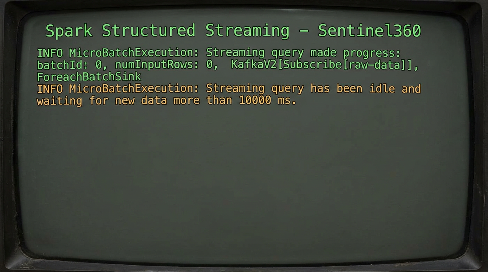

# Sentinel360 – Fase III: Streaming y carga multicapa (Hive + MongoDB)

## Objetivo

Calcular agregados de retrasos en ventanas de 15 minutos a partir del flujo de eventos (Kafka o ficheros en HDFS) y escribir cada micro-batch en:

- **Hive**: tabla `transport.aggregated_delays` (reporting histórico).
- **MongoDB** (opcional): colección `transport.aggregated_delays` (consultas de baja latencia).

## Componentes

| Componente | Función |
|------------|--------|
| `spark/streaming/delays_windowed.py` | Structured Streaming: lee Kafka o CSV en HDFS, agrupa por ventana 15 min + warehouse_id, escribe en Hive y MongoDB vía `foreachBatch`. |
| `spark/streaming/write_to_hive_and_mongo.py` | Job batch: lee Parquet desde `procesado/aggregated_delays` e inserta en la tabla Hive (cuando los agregados se generan por otro proceso). |
| `config.py` | `HIVE_AGGREGATED_DELAYS_TABLE`, `MONGO_URI`, `MONGO_DB`, `MONGO_AGGREGATED_COLLECTION`. |

## Configuración

### Hive

La tabla debe existir antes de lanzar el streaming:

```bash
beeline -u "jdbc:hive2://localhost:10000" -n hadoop -f hive/schema/04_aggregated_reporting.sql
```

Esquema: `window_start`, `window_end`, `warehouse_id`, `avg_delay_min`, `vehicle_count`.

### MongoDB (opcional)

1. Arrancar MongoDB (por ejemplo en localhost:27017).
2. Crear base y colección con índices:

   ```bash
   mongosh < mongodb/scripts/init_collection.js
   ```

   Esto crea `transport.vehicle_state` y `transport.aggregated_delays`.

3. Configuración: en `config.py` se usa `MONGO_URI` (por defecto `mongodb://localhost:27017`). Puedes sobrescribir con la variable de entorno:

   ```bash
   export MONGO_URI="mongodb://192.168.99.10:27017"
   ```

4. En la máquina donde se ejecuta `spark-submit` (driver): `pip install pymongo`. Si MongoDB no está disponible o no está instalado `pymongo`, el streaming sigue funcionando y solo escribe en Hive.

## Ejecución del streaming

Desde la raíz del proyecto:

```bash
# Entrada desde HDFS (CSV en /user/hadoop/proyecto/raw)
./scripts/run_spark_submit.sh spark/streaming/delays_windowed.py file

# Entrada desde Kafka (tema raw-data)
./scripts/run_spark_submit.sh spark/streaming/delays_windowed.py kafka
```

El job es de larga duración. Los logs del driver mostrarán mensajes del tipo `[batch N] Escribiendo agregados en Hive y MongoDB...` por cada micro-batch procesado.

Checkpoint de Structured Streaming: `hdfs://.../user/hadoop/proyecto/checkpoints/delays`. No borrar si quieres reanudar el mismo flujo sin duplicados.

## Salida en consola (qué verás al ejecutar)

Al lanzar el streaming en modo Kafka, la consola muestra el progreso de cada micro-batch en formato JSON. Ejemplo típico:

- **Progreso del batch**: `Streaming query made progress` con `batchId`, `numInputRows`, `timestamp`, tiempos de ejecución (`addBatch`, `triggerExecution`, etc.) y el estado del **watermark** (`eventTime.watermark`).
- **Origen**: `KafkaV2[Subscribe[raw-data)]` con `startOffset` / `endOffset` por partición (0, 1, 2) y métricas `avgOffsetsBehindLatest`.
- **Sink**: `ForeachBatchSink` (escritura en Hive y MongoDB en cada batch).
- **Estado**: operadores como `stateStoreSave` con `numRowsTotal`, `numRowsUpdated`, `memoryUsedBytes`, etc.

Cuando no llegan nuevos mensajes a Kafka, verás cada ~10 segundos:

```text
INFO MicroBatchExecution: Streaming query has been idle and waiting for new data more than 10000 ms.
```

Es el comportamiento esperado: el job sigue activo y procesará nuevos datos cuando se publiquen en el tema `raw-data`. Para comprobar que escribe en Hive/MongoDB, consulta las tablas o colecciones después de que haya habido datos en Kafka (o usa modo `file` con CSVs en HDFS raw).

A continuación, un ejemplo visual de la salida en consola al ejecutar el streaming (modo Kafka):



## Verificación

- **Hive**: `beeline -u "jdbc:hive2://localhost:10000" -n hadoop -e "USE transport; SELECT * FROM aggregated_delays LIMIT 10;"`
- **MongoDB**: `mongosh --eval "db.getSiblingDB('transport').aggregated_delays.find().limit(5)"`

## Carga batch (alternativa)

Si los agregados se escriben en HDFS como Parquet en `procesado/aggregated_delays` por otro job (por ejemplo un batch), puedes cargarlos en la tabla Hive con:

```bash
./scripts/run_spark_submit.sh spark/streaming/write_to_hive_and_mongo.py
```

Este script no escribe en MongoDB; para streaming + MongoDB se usa `delays_windowed.py` con `foreachBatch`.
