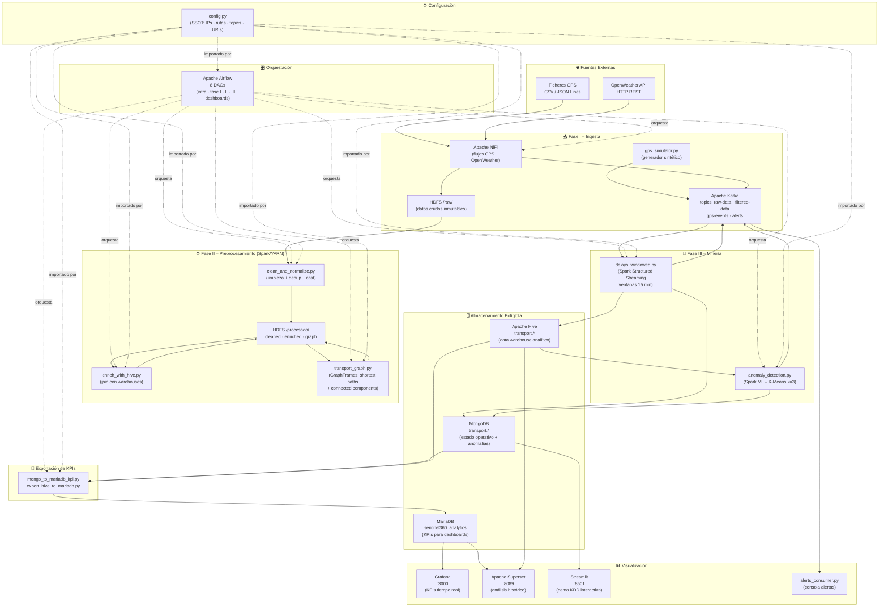
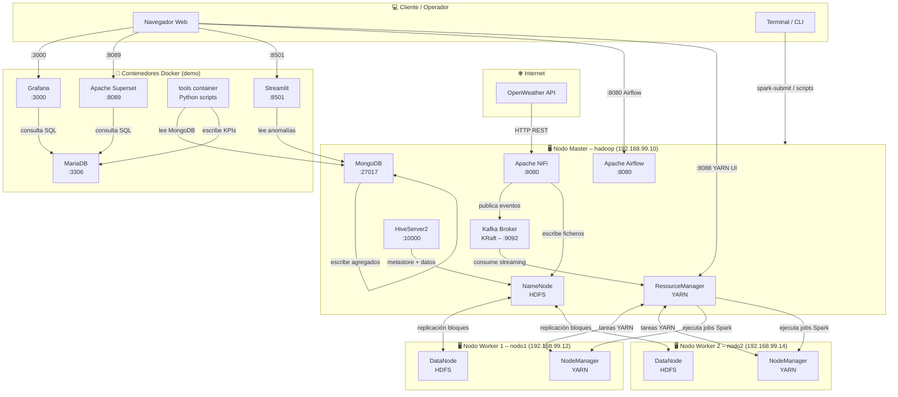
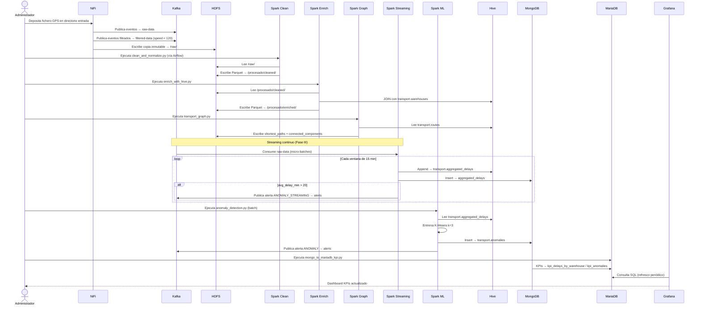
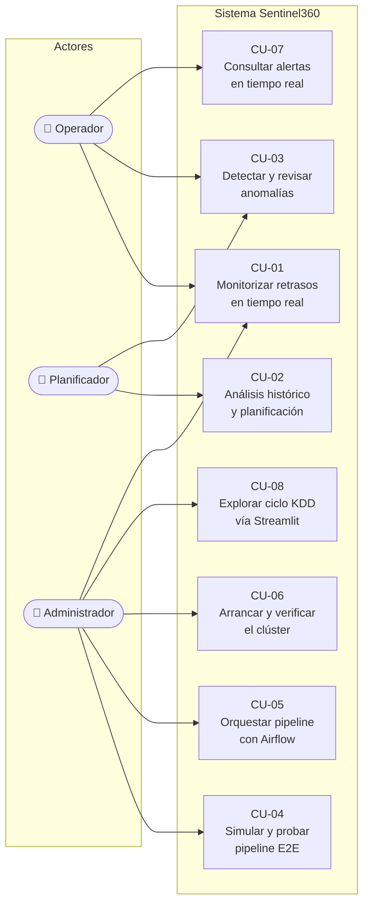
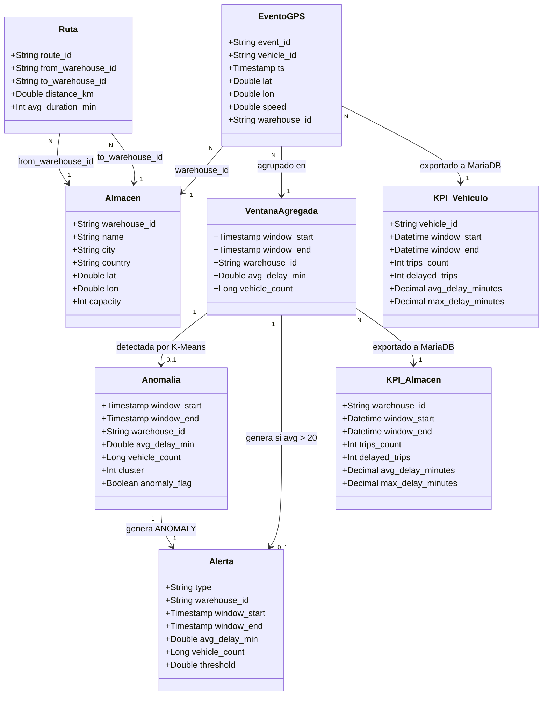
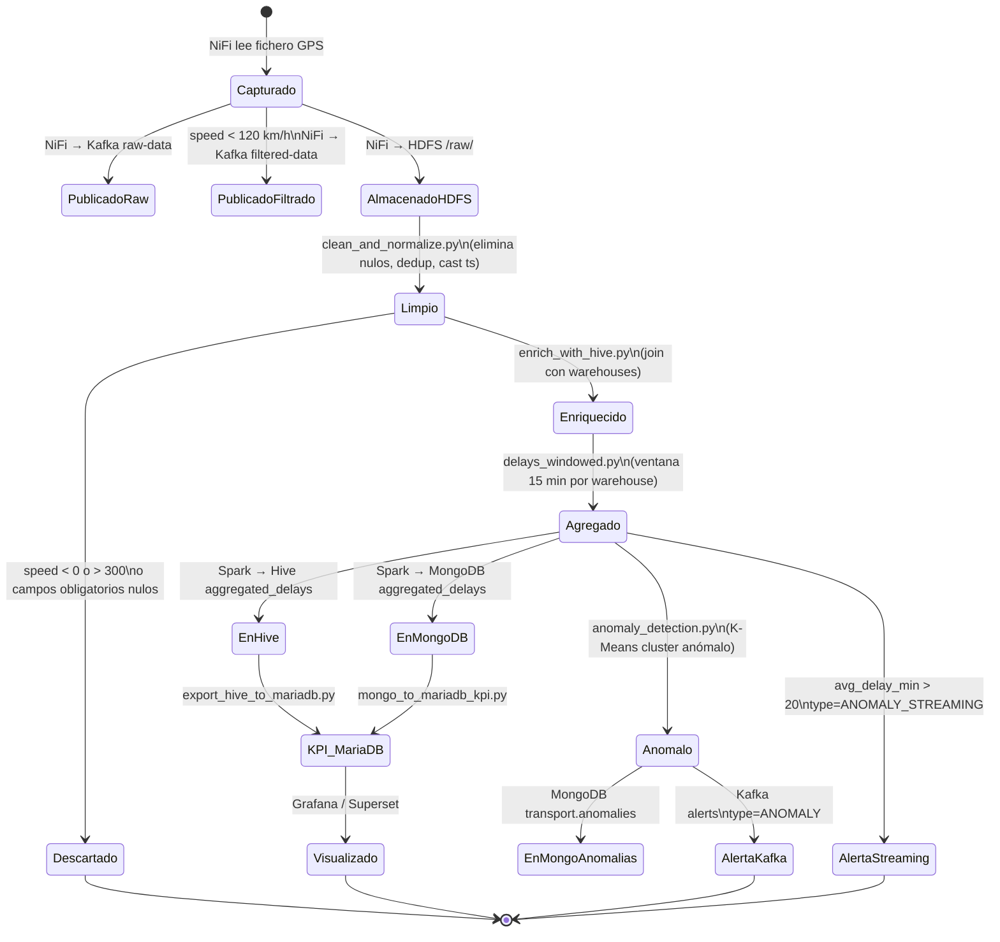
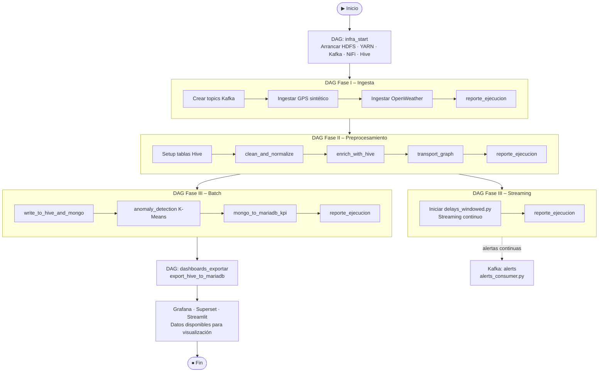

# Diagramas UML – Sentinel360

> Todos los diagramas están en formato **Mermaid**.  
> Puedes visualizarlos en:
> - **VS Code**: instala la extensión [Markdown Preview Mermaid Support](https://marketplace.visualstudio.com/items?itemName=bierner.markdown-mermaid)
> - **Online**: copia cualquier bloque en [https://mermaid.live](https://mermaid.live)
> - **GitHub**: se renderizan automáticamente en cualquier `.md`

---

## 1. Diagrama de Componentes (C4 – Nivel 2)

Muestra los principales bloques del sistema y sus dependencias.



---

## 2. Diagrama de Despliegue (Infraestructura)

Muestra la distribución física de servicios en los tres nodos del clúster.



---

## 3. Diagrama de Secuencia – Pipeline KDD Completo

Flujo de datos extremo a extremo desde la ingesta hasta la visualización.



---

## 4. Diagrama de Casos de Uso

Actores y sus interacciones con el sistema.



---

## 5. Diagrama de Clases – Modelos de Datos

Esquema lógico de las entidades principales y sus relaciones.



---

## 6. Diagrama de Estados – Ciclo de Vida de un Evento GPS



---

## 7. Diagrama de Actividad – Orquestación Airflow (Pipeline Completo)



---

## Cómo visualizar estos diagramas

### Opción 1 – VS Code (recomendado)
1. Instala la extensión **Markdown Preview Mermaid Support** (`bierner.markdown-mermaid`)
2. Abre este fichero y pulsa `Ctrl+Shift+V` para la vista previa

### Opción 2 – Online (sin instalación)
1. Ve a [https://mermaid.live](https://mermaid.live)
2. Copia el contenido de cualquier bloque ` ```mermaid ` y pégalo en el editor

### Opción 3 – GitHub
Los bloques Mermaid se renderizan automáticamente en cualquier fichero `.md` del repositorio.

### Opción 4 – Exportar a PNG/SVG
En [https://mermaid.live](https://mermaid.live) puedes exportar cada diagrama como PNG o SVG desde el botón "Export".
